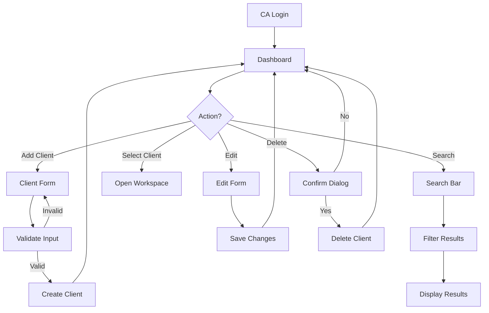

# Client Workflow Feature Specification

**Feature Name:** Client Workflow Management
**Document Version:** 1.0
**Last Updated:** 2025-09-21
**Feature Owner:** Product Team
**Status:** MVP Core Feature

---

## =Ë Feature Overview

The Client Workflow feature enables Chartered Accountants to efficiently manage their client portfolio through a centralized dashboard. This is the entry point to the Finfelo platform where CAs can create, organize, and access all their clients.

---

## <¯ Business Objectives

- **Reduce client onboarding time** from 15-20 minutes to under 3 minutes
- **Enable efficient management** of 50-500+ clients per CA
- **Provide instant access** to any client workspace with search/filter
- **Maintain compliance** through comprehensive audit trails
- **Support both individual CAs and multi-partner firms**

---

## =e User Stories

### Epic: Client Management

#### Story 1: Create New Client
**As a** CA user
**I want to** create a new client profile
**So that** I can start managing their documents and tax computations

**Acceptance Criteria:**
- User can access "Add Client" button from dashboard
- Mandatory fields are validated (Name, Type, PAN/Tax ID)
- Client is immediately visible in dashboard after creation
- System generates unique client ID
- Creation timestamp is recorded in audit log

#### Story 2: View Client Dashboard
**As a** CA user
**I want to** see all my clients in one place
**So that** I can quickly access any client's workspace

**Acceptance Criteria:**
- Dashboard loads within 2 seconds for up to 100 clients
- Displays client name, type, status, last activity
- Shows total client count and active/inactive breakdown
- Supports pagination (25/50/100 per page)
- Responsive design for different screen sizes

#### Story 3: Search and Filter Clients
**As a** CA user
**I want to** search and filter my client list
**So that** I can quickly find specific clients

**Acceptance Criteria:**
- Search by client name, PAN, phone, email
- Filter by client type (Individual/Business)
- Filter by status (Active/Inactive/Pending)
- Filter by date range (created/modified)
- Search results appear within 1 second
- Filters can be combined

#### Story 4: Edit Client Information
**As a** CA user
**I want to** update client details
**So that** I can keep information current

**Acceptance Criteria:**
- Edit button available on client card/row
- All fields except client ID are editable
- Changes are saved with versioning
- Edit history maintained in audit log
- Confirmation prompt for critical changes

#### Story 5: Delete Client
**As a** CA user
**I want to** remove clients I no longer service
**So that** I can maintain a clean workspace

**Acceptance Criteria:**
- Delete requires confirmation dialog
- Soft delete (archived) vs hard delete options
- All associated data is handled appropriately
- Deletion logged with timestamp and reason
- Option to restore within 30 days (soft delete)

#### Story 6: Bulk Operations
**As a** CA firm partner
**I want to** perform bulk actions on multiple clients
**So that** I can manage large portfolios efficiently

**Acceptance Criteria:**
- Multi-select checkbox for each client
- Bulk export to CSV/Excel
- Bulk status update
- Bulk assignment to team members (future)
- Progress indicator for bulk operations

---

## =' Functional Requirements

### Client Data Model

```javascript
{
  clientId: "auto-generated-uuid",
  clientType: "Individual" | "Business",

  // Basic Information
  name: {
    first: "string",
    middle: "string (optional)",
    last: "string"
  },
  businessName: "string (for Business type)",

  // Tax Information
  pan: "string (10 chars)",
  aadhaar: "string (12 digits, encrypted)",
  gst: "string (optional, for business)",

  // Contact Information
  email: "string",
  phone: {
    primary: "string",
    alternate: "string (optional)"
  },
  address: {
    line1: "string",
    line2: "string (optional)",
    city: "string",
    state: "string",
    pincode: "string",
    country: "India" // Default for MVP
  },

  // Metadata
  status: "Active" | "Inactive" | "Pending",
  createdAt: "timestamp",
  updatedAt: "timestamp",
  createdBy: "userId",
  lastActivityAt: "timestamp",
  tags: ["string"],
  notes: "string (optional)",

  // Compliance
  financialYear: "2024-25",
  itrStatus: "Not Started" | "In Progress" | "Filed" | "Acknowledged",
  lastFilingDate: "date"
}
```

### Dashboard UI Components

1. **Header Section**
   - Logo and platform name
   - Search bar (global)
   - User profile menu
   - Notifications icon

2. **Stats Bar**
   - Total Clients counter
   - Active Clients counter
   - Pending ITR counter
   - This Month's Filings counter

3. **Action Bar**
   - "Add Client" button (primary CTA)
   - View toggle (Grid/List)
   - Filter dropdown
   - Sort options
   - Export button

4. **Client Grid/List View**
   - Client cards in grid view
   - Table rows in list view
   - Click to open workspace
   - Quick actions menu (...)

5. **Pagination Controls**
   - Page numbers
   - Items per page selector
   - Total results count

---

## =» Technical Specifications

### API Endpoints

```yaml
# Client CRUD Operations
POST   /api/clients          # Create new client
GET    /api/clients          # List all clients (paginated)
GET    /api/clients/:id      # Get specific client
PUT    /api/clients/:id      # Update client
DELETE /api/clients/:id      # Delete client

# Search and Filter
GET    /api/clients/search   # Search clients
GET    /api/clients/filter   # Filter clients

# Bulk Operations
POST   /api/clients/bulk     # Bulk operations
GET    /api/clients/export   # Export to CSV/Excel
```

### Performance Requirements

- Dashboard load time: < 2 seconds
- Search response: < 1 second
- Client creation: < 3 seconds
- Pagination: < 500ms
- Support 500 concurrent users

### Security Requirements

- All client data encrypted at rest (AES-256)
- PAN and Aadhaar fields masked in UI
- Role-based access control
- Audit log for all operations
- Session timeout after 30 minutes

---

## <¨ UI/UX Guidelines

### Design Principles
- **Minimal and clean** - Reduce cognitive load
- **Consistent** - Same patterns throughout
- **Accessible** - WCAG 2.1 compliant
- **Responsive** - Works on 1366px+ screens
- **Fast** - Instant feedback for all actions

### Client Card Design (Grid View)
```
+----------------------------------+
| [Business/Individual Badge]      |
|                                  |
| Client Name                      |
| PAN: XXXXX1234X                  |
|                                  |
| =ç email@example.com             |
| =ñ +91 98765 43210              |
|                                  |
| Status: [Active Badge]           |
| Last Activity: 2 days ago        |
|                                  |
| [Edit] [Delete] [Open Workspace] |
+----------------------------------+
```

### List View Columns
- Select checkbox
- Client Name
- Type (Individual/Business)
- PAN
- Phone
- Email
- Status
- ITR Status
- Last Activity
- Actions

---

## = User Flow



---

## =Ê Success Metrics

- **Adoption Rate:** 80% of users create 5+ clients in first week
- **Search Usage:** Average 10+ searches per user per day
- **Error Rate:** < 1% failed client creations
- **Performance:** 95% of dashboard loads under 2 seconds
- **User Satisfaction:** > 4.5/5 rating for client management

---

## =¦ Dependencies

- Authentication service (user context)
- Database service (client storage)
- Audit logging service
- Search indexing service
- Export service (CSV/Excel generation)

---

##   Edge Cases & Error Handling

1. **Duplicate PAN Detection**
   - Check for existing PAN before creation
   - Show warning with existing client details
   - Allow override with confirmation

2. **Network Failures**
   - Auto-save draft for client creation
   - Retry mechanism for failed requests
   - Offline indicator with queued actions

3. **Data Validation**
   - PAN format validation (XXXXX9999X)
   - Email format validation
   - Phone number validation (+91 10 digits)
   - Pincode validation (6 digits)

4. **Concurrent Edits**
   - Optimistic locking for client updates
   - Show conflict resolution dialog
   - Maintain edit history

5. **Large Data Sets**
   - Virtual scrolling for 100+ clients
   - Lazy loading for client details
   - Progressive search with debouncing

---

## =. Future Enhancements (Post-MVP)

- Team collaboration (assign clients to team members)
- Client categorization and custom tags
- Advanced analytics dashboard
- Client communication log
- Document checklist templates
- Automated client onboarding workflows
- Integration with government portals
- Mobile app support
- Bulk import from Excel/CSV
- Client portal access

---

## =Ý Notes

- This is the foundation feature - must be rock solid
- Performance is critical for CA productivity
- Search is the most used feature after client creation
- Consider keyboard shortcuts for power users
- Mobile-responsive design for future mobile app